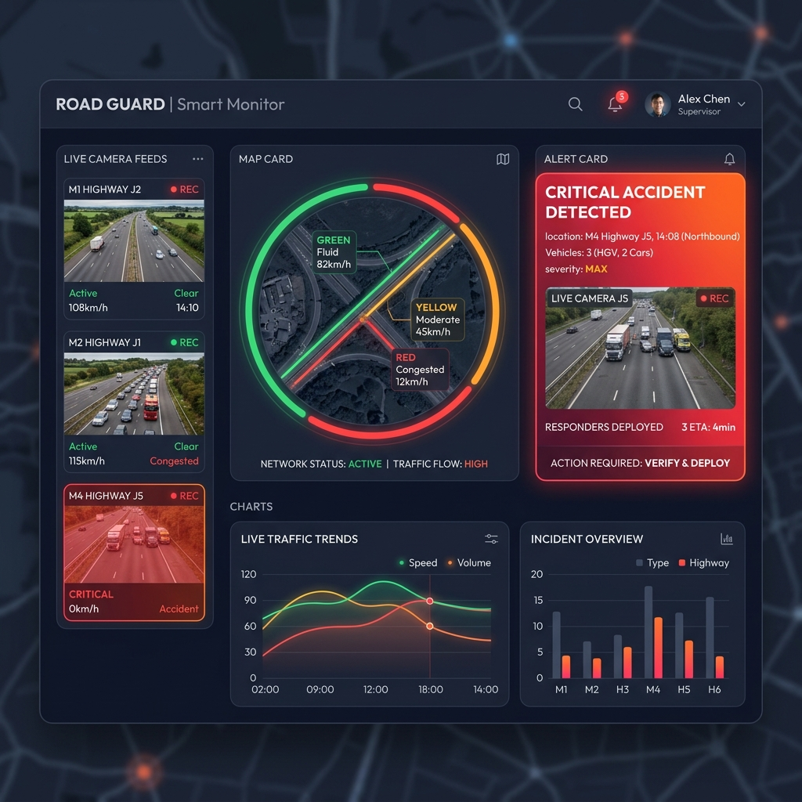
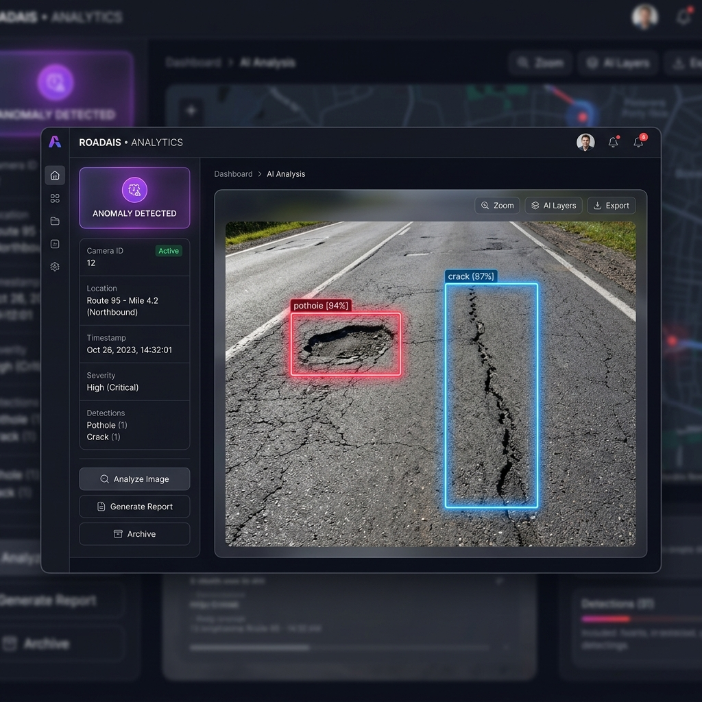

# Smart Road Monitor & Accident Detection System

A state-of-the-art, dual-telemetry full-stack platform designed to identify, categorize, and report **Severe Road Accidents** and **Road Infrastructure Anomalies** (e.g., potholes, cracks) in real-time. Built using a high-performance modern tech stack with cross-origin microservice routing, real-time AI computer vision models, and robust enterprise-grade security.

---

## 📸 SYSTEM VISUAL PREVIEWS

### 1. Unified Telemetry Dashboard
An interactive dark-mode control center showcasing real-time camera coordinates, vehicle densities, anomaly counters, and critical emergency responder sirens.


### 2. Real-Time AI Inference Portal
Interactive file upload interface depicting actual YOLO prediction boundaries around detected road cracks and asphalt pavement anomalies.


---

## 🛠️ TECH STACK

- **React (Vite)**: Sleek, high-performance dark-mode UI with Axios-based dual-channel API routing.
- **ASP.NET Core 10 Web API**: Hardened security middleware, SQLite EF Core integration, role-based authorization, and JWT credential validation.
- **FastAPI AI Backend**: High-throughput inference layer powered by `ultralytics` YOLO, exposing dynamic weights execution with unified class mapping taxonomy.
- **SQLite Database**: Lightweight local structured relational storage for camera state and historical alerts.
- **YOLOv8 Vision Model**: Pre-trained or custom-weights object detection targeting pavement cracks, potholes, and vehicular accidents.

---

## 📁 ARCHITECTURAL DIRECTORY STRUCTURE

```text
AccidentDetectionSysrem_v2/
├── src/                          # React + Vite Frontend
│   ├── components/               # Reusable UI widgets
│   ├── context/                  # AuthContext and AppState modules
│   ├── pages/                    # Views (Dashboard, SignIn, SignUp, Report)
│   └── services/
│       ├── api.js                # [UPDATED] Dual-Axios Client (api & aiApi)
│       └── aiAnalysis.service.js # [UPDATED] Axios-based FastAPI Caller
│
├── api/                          # ASP.NET Core 10.0 Web API
│   ├── Controllers/              # REST Endpoints (Accidents, Detections, Auth)
│   ├── DTO/                      # Request/Response Data Transfer Objects
│   ├── modelsef/                 # EF Core database contexts & schemas
│   ├── SmartAccidentdb.db        # SQLite database
│   ├── appsettings.json          # Key configuration profiles
│   └── Program.cs                # [UPDATED] Resilient startup & CORS sequence
│
├── ai-backend/                   # FastAPI AI Analysis Engine
│   ├── best.pt                   # Optional custom YOLO model weights
│   ├── main.py                   # [UPDATED] YOLO inference & taxonomy map
│   └── requirements.txt          # [UPDATED] Python libraries with ultralytics
│
└── assets/                       # UI mockups and visual documentation
```

---

## 🚨 KEY ARCHITECTURAL UPGRADES (v2.0)

### 1. Unified Computer Vision Taxonomy (`ai-backend/main.py`)
Previously, the system split road defect monitoring and accident reporting into conflicting entities. The FastAPI backend now acts as a **unified bridge**, automatically parsing predictions into categorized domains:
- **Accidents**: `accident`, `crash`, `collision`, `fire`, `smoke` $\rightarrow$ **Critical Severity**
- **Road Anomalies**: `pothole`, `crack`, `defect`, `rutting`, `bump` $\rightarrow$ **High/Medium Severity**
- **Standard Telemetry**: `car`, `truck`, `bus`, `pedestrian` $\rightarrow$ **Low Severity**

### 2. Dual Axios Integration (`src/services/api.js`)
We replaced the single Axios instance with two isolated modules to resolve CORS and routing issues:
1. `api` (Default): Targets the `.NET API` (`VITE_API_BASE_URL`) injecting bearer tokens automatically for secure database transactions.
2. `aiApi` (Named Export): Targets the `FastAPI AI` service (`VITE_AI_API_BASE_URL`). Configured with boundary-safe multipart form handlers and an extended 60-second timeout to accommodate model initialization.

### 3. Startup Assertions & Key Hardening (`api/Program.cs`)
.NET Core 10 strictly enforces key sizes of $\ge 256$ bits (32 bytes) for HS256-based JWT authentication. `Program.cs` now triggers explicit startup assertions to validate the following configurations before spawning:
- Verification of SQLite connection strings.
- Validation that the JWT Key is non-empty and contains at least **32 bytes** to prevent obscure security provider exceptions.
- Hardened CORS execution sequences (`UseCors` $\rightarrow$ `UseAuthentication` $\rightarrow$ `UseAuthorization`).

---

## ⚡ LOCAL DEVELOPMENT SETUP GUIDE

### Prerequisites
Ensure the following packages are installed on your workstation:
- **Node.js**: `v20.x` or higher (check with `node --version`)
- **.NET SDK**: `v10.0` or higher (check with `dotnet --version`)
- **Python**: `v3.10` or higher (check with `python --version`)

---

### Step 1: Frontend Setup

1. From the project root, install Node packages:
   ```bash
   npm install
   ```

2. Create a `.env` file in the root directory:
   ```env
   VITE_API_BASE_URL=http://localhost:5070/api
   VITE_AI_API_BASE_URL=http://localhost:8000
   ```
   *(To route predictions to a hosted space, modify `VITE_AI_API_BASE_URL` to point to your space endpoint).*

---

### Step 2: .NET 10.0 Web API Setup

1. Navigate to the `api` folder and restore packages:
   ```bash
   cd api
   dotnet restore
   dotnet build
   ```

2. Generate or update SQLite relational schemas:
   ```bash
   dotnet ef database update
   ```
   *(If `dotnet ef` is missing, install it globally using `dotnet tool install --global dotnet-ef`).*

---

### Step 3: FastAPI AI Prediction Engine Setup

1. Navigate to `ai-backend` and initialize a virtual environment:
   ```bash
   cd ai-backend
   python -m venv .venv
   ```

2. Activate the virtual environment:
   - **Windows PowerShell**:
     ```powershell
     .venv\Scripts\activate
     ```
   - **Linux/macOS**:
     ```bash
     source .venv/bin/activate
     ```

3. Install requirements (including the YOLO pipeline library):
   ```bash
   pip install -r requirements.txt
   ```

---

## 🚀 RUNNING THE SYSTEM

Open **three** independent terminal windows:

### Terminal 1: .NET API Web Server
Starts the database connection, Swagger docs, and responder auth channels.
```bash
dotnet run --project api/AccidentDetectionSysrem.csproj --launch-profile http
```
- **Local Address**: [http://localhost:5070](http://localhost:5070)
- **Interactive Swagger Docs**: [http://localhost:5070/swagger/index.html](http://localhost:5070/swagger/index.html)

### Terminal 2: FastAPI AI Prediction Engine
Spawns the computer vision model to listen for uploaded images.
```bash
cd ai-backend
# Activate your virtual environment
.venv\Scripts\activate
python -m uvicorn main:app --host 127.0.0.1 --port 8000 --reload
```
- **Inference Address**: [http://localhost:8000](http://localhost:8000)
- **Engine Health Check**: [http://localhost:8000/health](http://localhost:8000/health)

### Terminal 3: React Frontend Dev Server
Spawns the Vite asset bundler.
```bash
npm run dev
```
- **Web App UI**: [http://127.0.0.1:5173](http://127.0.0.1:5173)

---

## 📡 DUAL-TELEMETRY RESPONSE MODEL CONTRACT (API Output)

Inbound image requests targeting `/predict/{model_name}` return a normalized JSON payload satisfying both infrastructure telemetry and accident response expectations:

```json
{
  "status": "success",
  "message": "ALERT: Severe accident incident detected.",
  "model_name": "yolov8",
  "camera_id": "12",
  "analysis_type": "accident",
  "location": "Route 95",
  "filename": "camera_feed_09.png",
  "detections": [
    {
      "class_name": "accident",
      "type": "accident",
      "confidence": 0.9412,
      "bbox": [100.0, 200.0, 150.0, 250.0]
    },
    {
      "class_name": "pothole",
      "type": "anomaly",
      "confidence": 0.8250,
      "bbox": [300.0, 400.0, 350.0, 450.0]
    }
  ],
  "has_anomaly": true,
  "has_accident": true,
  "severity": "critical",
  "confidence": 0.9412,
  "processing_time": 0.2854,
  "image_size": {
    "width": 1280,
    "height": 720
  }
}
```

---

## 🔐 AUTHENTICATION & SECURITY CONTROLLER ROLE MAPPINGS

Users can sign up at `http://127.0.0.1:5173/signup` under three distinct system roles:
- **`Admin`**: Redirects to User Management Panel to audit and authorize cameras.
- **`Officer`**: Redirects to Weekly Analytics Dashboard and Emergency Dispatcher console.
- **`User`**: Redirects to the general Road Telemetry Dashboard.

---

## 🔍 TROUBLESHOOTING & COMMON PROBLEMS

### 1. Network Error During Login/Registration
- **Cause**: The `.NET API` is offline, or the frontend `.env` configuration contains an invalid endpoint port.
- **Resolution**: Verify that Swagger loads at `http://localhost:5070/swagger/index.html`. If the port shifted, update `.env` and restart Vite.

### 2. AI Inference Image Upload Refused
- **Cause**: FastAPI server is stopped, or the browser boundary string was corrupted by manually setting a custom boundary header.
- **Resolution**: Ensure FastAPI is running by accessing `http://localhost:8000/health`. In frontend code, do not hardcode `Content-Type` for `FormData` postings—allow Axios to auto-inject the boundary.

### 3. Startup Crash: "Cryptographic Key Length Is Insecure"
- **Cause**: You provided a short, unsafe key for JWT authorization.
- **Resolution**: Go to `api/appsettings.json`, and ensure `"Jwt:Key"` is at least **32 characters long** to satisfy cryptographic HS256 constraints.
